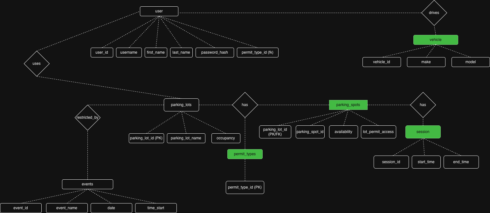

# ParkGrid

A real-time smart parking availability system that helps drivers find open spots instantly. Built with Django REST Framework, React, and simulated IoT sensors.

## What it does

ParkGrid tracks parking lot occupancy in real-time. Users can see which lots have space, drill down to individual spots, and watch availability change live as cars come and go.


## ER Diagram:



## Features

- **Live Dashboard** - See all parking lots with available/total spots and occupancy percentage
- **Individual Spot View** - Click any lot to see exactly which spots are free (green) or taken (red)
- **Real-time Updates** - Data refreshes every 3 seconds automatically
- **Search** - Filter lots by name
- **User Authentication** - JWT-based login/register system
- **IoT Simulation** - Simulates parking sensors detecting cars entering/leaving

## Tech Stack

**Backend**
- Python 3.12
- Django 6.0
- Django REST Framework
- Simple JWT for authentication
- SQLite (development)

**Frontend**
- React 19
- CSS3 with modern styling
- Fetch API for data

**Architecture**
- RESTful API design
- Polling-based real-time updates (WebSocket-ready)
- Normalized database with 7 tables

## Database Schema

| Table | Purpose |
|-------|---------|
| User | Custom user model with permit linking |
| PermitType | Student, Faculty, Visitor classifications |
| Vehicle | User vehicles (one-to-many) |
| ParkingLot | Physical lots with occupancy tracking |
| ParkingSpot | Individual spots with availability status |
| Event | Game day restrictions on lots |
| Session | Tracks parking sessions (who parked where, when) |

## Getting Started

### Prerequisites
- Python 3.10+
- Node.js 18+
- npm

### Installation

1. **Clone the repo**
   ```bash
   git clone https://github.com/yourusername/parkgrid.git
   cd parkgrid
   ```

2. **Set up backend**
   ```bash
   cd backend
   python -m venv venv
   source venv/bin/activate  # On Windows: venv\Scripts\activate
   pip install -r parking_system/requirements.txt
   cd parking_system
   python manage.py migrate
   python manage.py seed_data
   ```

3. **Set up frontend**
   ```bash
   cd frontend
   npm install
   ```

### Running the app

**Option 1: Use the run script**
```bash
./run.sh
```

**Option 2: Run manually (3 terminals)**

Terminal 1 - Backend:
```bash
cd backend
source venv/bin/activate
cd parking_system
python manage.py runserver
```

Terminal 2 - Frontend:
```bash
cd frontend
npm start
```

Terminal 3 - IoT Simulator:
```bash
cd backend
source venv/bin/activate
cd parking_system
python manage.py simulate_sensors
```

4. **Open the app**
   - Frontend: http://localhost:3000
   - API: http://127.0.0.1:8000/api/
   - Admin: http://127.0.0.1:8000/admin/

### Demo Account
- Username: `demo`
- Password: `demo123`

## API Endpoints

| Endpoint | Method | Description |
|----------|--------|-------------|
| `/api/dashboard/` | GET | Summary of all lots with availability |
| `/api/lots/` | GET | List all parking lots |
| `/api/spots/?parking_lot={id}` | GET | Get spots for a specific lot |
| `/api/register/` | POST | Create new user |
| `/api/token/` | POST | Get JWT access token |
| `/api/token/refresh/` | POST | Refresh JWT token |

## Project Structure

```
parkgrid/
├── backend/
│   ├── venv/
│   └── parking_system/
│       ├── parking/
│       │   ├── models.py          # Database models
│       │   ├── views.py           # API endpoints
│       │   ├── serializers.py     # DRF serializers
│       │   └── management/
│       │       └── commands/
│       │           ├── seed_data.py        # Database seeding
│       │           └── simulate_sensors.py # IoT simulation
│       └── parking_system/
│           ├── settings.py
│           └── urls.py
├── frontend/
│   ├── public/
│   └── src/
│       ├── App.js        # Main dashboard component
│       ├── Login.js      # Auth component
│       └── App.css       # Styling
└── run.sh
```

## How the IoT Simulation Works

The `simulate_sensors` command mimics real parking sensors:

1. Randomly selects a parking spot every 2 seconds
2. 60% chance to flip its availability (car arrived or left)
3. Updates the lot's occupancy count
4. Logs the event to console

In production, this would be replaced by actual IoT sensor data via webhooks or MQTT.

## Future Improvements

- [ ] Campus map view with lot locations
- [ ] Historical occupancy charts
- [ ] Peak hours prediction
- [ ] Mobile app
- [ ] Push notifications when spots open
      
